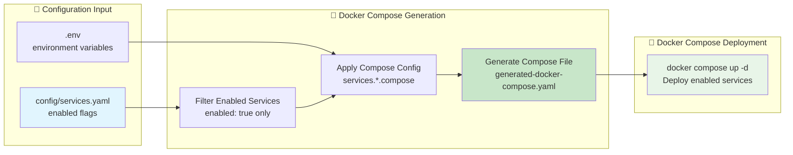

# Docker Compose Service Enablement Analysis

**Date**: 2025-01-08
**Purpose**: Analysis 2.1 - Analyze service enablement for Docker Compose deployment type
**Issue**: [#22](https://github.com/chutch3/selfhosted.sh/issues/22) - services.yaml Configuration Concerns

## Executive Summary

This analysis examines service enablement tracking specifically for Docker Compose deployments. **Critical Context**: Deployment types are mutually exclusive - when using Docker Compose, only Docker Compose artifacts are generated and deployed. This analysis focuses exclusively on the Docker Compose deployment path and how `config/services.yaml` serves as the single source of truth for Docker Compose service activation.

## 1. Docker Compose Deployment Context

### 🐳 Deployment Type Exclusivity

#### Key Architectural Understanding:
```yaml
# Deployment types are mutually exclusive
deployment_types:
  docker_compose:
    description: "Single-node or manual multi-node Docker Compose deployment"
    artifacts: ["generated-docker-compose.yaml", "generated-nginx/", ".domains"]
    use_case: "Development, single-node production, manual multi-node"
    exclusivity: "Cannot be used simultaneously with Swarm or K8s"

  docker_swarm:
    description: "Docker Swarm orchestrated multi-node deployment"
    artifacts: ["generated-swarm-stack.yaml", "generated-nginx/", ".domains"]
    use_case: "Orchestrated multi-node production"
    exclusivity: "Cannot be used simultaneously with Compose or K8s"

  kubernetes:
    description: "Future Kubernetes deployment (not yet implemented)"
    artifacts: ["generated-k8s/", "generated-nginx/", ".domains"]
    use_case: "Advanced orchestration"
    exclusivity: "Cannot be used simultaneously with Compose or Swarm"
```

#### Current Docker Compose Focus:
- **Architecture Diagram**: Represents Docker Compose deployment type only
- **Service Enablement**: Controls which services appear in `generated-docker-compose.yaml`
- **Single Source**: `config/services.yaml` controls Docker Compose service inclusion
- **No Swarm Interaction**: Swarm-specific features irrelevant for Compose deployment

## 2. Docker Compose Service Enablement Implementation

### ✅ Configuration Structure for Docker Compose

#### services.yaml Structure (Docker Compose Relevant):
```yaml
# config/services.yaml - Docker Compose focused view
version: '1.0'
categories:
  core: Core Infrastructure      # ✅ Used for Docker Compose categorization
  finance: Finance & Budgeting   # ✅ Used for Docker Compose categorization

defaults:
  domain_pattern: ${service}.${BASE_DOMAIN}  # ✅ Used in Docker Compose generation
  restart_policy: unless-stopped            # ✅ Applied to Docker Compose services
  networks:
    - reverseproxy                          # ✅ Docker Compose network configuration

services:
  homepage:
    name: Homepage Dashboard
    category: core
    enabled: true                           # ✅ Controls Docker Compose inclusion
    compose:                               # ✅ Docker Compose specific configuration
      image: ghcr.io/gethomepage/homepage:latest
      ports:
        - "3000:3000"
      # Swarm section irrelevant for Docker Compose deployment
```

### 🔍 Docker Compose Generation Logic

#### Service Filtering for Docker Compose:
```bash
# Service generation logic for Docker Compose
generate_compose_from_services() {
    echo "🐳 Generating Docker Compose services..."

    # Get enabled services only
    local enabled_services
    enabled_services=$(yq '.services | to_entries[] | select(.value.enabled == true) | .key' "$SERVICES_CONFIG")

    # Process each enabled service for Docker Compose
    while read -r service_key; do
        echo "  📦 Processing $service_key for Docker Compose..."
        generate_docker_compose_service "$service_key"
    done <<< "$enabled_services"

    # Note: Swarm-specific logic not relevant for Docker Compose deployment
}
```

#### Docker Compose Artifact Generation:
```bash
# Docker Compose specific generation pipeline
docker_compose_generation_pipeline() {
    validate_services_config
    load_environment_variables

    # Generate Docker Compose specific artifacts only
    generate_compose_from_services     # ✅ Main Docker Compose file
    generate_nginx_templates           # ✅ Reverse proxy config
    generate_domains_env              # ✅ Domain environment variables

    # Swarm artifacts not generated in Compose deployment
    # generate_swarm_stack_from_services  # ❌ Not used in Compose deployment
}
```

### 📊 Current Docker Compose Service Status

#### Enabled Services Analysis (Docker Compose):
```bash
# Analysis of enabled services for Docker Compose deployment
enabled_services_docker_compose:
  homepage:
    enabled: true
    compose_config: ✅ Present
    docker_compose_output: ✅ Included

  actual:
    enabled: true
    compose_config: ✅ Present
    docker_compose_output: ✅ Included

  cryptpad:
    enabled: false
    compose_config: ✅ Present
    docker_compose_output: ❌ Excluded (disabled)

  homeassistant:
    enabled: true
    compose_config: ✅ Present
    docker_compose_output: ✅ Included
```

#### Docker Compose Output Verification:
```yaml
# generated-docker-compose.yaml structure
version: '3.8'
services:
  homepage:           # ✅ Enabled service included
    image: ghcr.io/gethomepage/homepage:latest
    restart: unless-stopped

  actual:             # ✅ Enabled service included
    image: actualbudget/actual-server:latest
    restart: unless-stopped

  homeassistant:      # ✅ Enabled service included
    image: ghcr.io/home-assistant/home-assistant:stable
    restart: unless-stopped

  # cryptpad not included - disabled in services.yaml
```

## 3. Docker Compose Service Enablement Workflow

### 🔄 Service Enable/Disable Process

#### Service Enablement for Docker Compose:
```bash
# Docker Compose service enablement workflow
enable_service_for_docker_compose() {
    local service_name="$1"

    # Update services.yaml
    yq eval ".services.$service_name.enabled = true" -i "$SERVICES_CONFIG"

    # Regenerate Docker Compose artifacts
    echo "🐳 Regenerating Docker Compose artifacts..."
    generate_compose_from_services
    generate_nginx_templates
    generate_domains_env

    # Deploy changes (Docker Compose specific)
    if [ -f "generated-docker-compose.yaml" ]; then
        echo "🚀 To apply changes: docker compose up -d"
    fi

    # Note: No Swarm considerations for Docker Compose deployment
}
```

#### Service Disablement for Docker Compose:
```bash
# Docker Compose service disablement workflow
disable_service_for_docker_compose() {
    local service_name="$1"

    # Update services.yaml
    yq eval ".services.$service_name.enabled = false" -i "$SERVICES_CONFIG"

    # Regenerate Docker Compose artifacts (service will be excluded)
    echo "🐳 Regenerating Docker Compose artifacts..."
    generate_compose_from_services
    generate_nginx_templates
    generate_domains_env

    # Docker Compose will remove disabled service on next deployment
    echo "🚀 To apply changes: docker compose up -d"
    echo "📝 Service $service_name will be stopped and removed"
}
```

### 📋 Docker Compose Enablement Tracking

#### Current Tracking Mechanisms:
```bash
# Docker Compose enablement tracking
docker_compose_tracking:
  primary_source: "config/services.yaml enabled flags"
  generated_tracking: ".enabled-services file"
  verification: "generated-docker-compose.yaml service count"
  cli_interface: "./selfhosted.sh service enable/disable"
```

#### Enablement State Verification:
```bash
# Verify Docker Compose enablement state
verify_docker_compose_enablement() {
    echo "🔍 Verifying Docker Compose service enablement..."

    # Count enabled services in config
    local enabled_count
    enabled_count=$(yq '.services | to_entries[] | select(.value.enabled == true) | .key' "$SERVICES_CONFIG" | wc -l)

    # Count services in generated Docker Compose
    local compose_count
    compose_count=$(yq '.services | keys | length' "generated-docker-compose.yaml" 2>/dev/null || echo "0")

    echo "📊 Enabled in config: $enabled_count"
    echo "📊 Generated in Docker Compose: $compose_count"

    if [ "$enabled_count" -eq "$compose_count" ]; then
        echo "✅ Docker Compose enablement state consistent"
    else
        echo "❌ Docker Compose enablement state inconsistent"
    fi
}
```

## 4. Docker Compose Configuration Consistency

### 🎯 Single Source of Truth for Docker Compose

#### Configuration Flow (Docker Compose Only):


#### Configuration Validation (Docker Compose Specific):
```bash
# Docker Compose configuration validation
validate_docker_compose_config() {
    echo "🔍 Validating Docker Compose configuration..."

    # Validate services.yaml structure
    if ! yq eval '.services' "$SERVICES_CONFIG" > /dev/null 2>&1; then
        echo "❌ Invalid services.yaml structure"
        return 1
    fi

    # Validate enabled services have compose configuration
    local invalid_services=()
    while read -r service_key; do
        if ! yq eval ".services.$service_key.compose" "$SERVICES_CONFIG" > /dev/null 2>&1; then
            invalid_services+=("$service_key")
        fi
    done < <(yq '.services | to_entries[] | select(.value.enabled == true) | .key' "$SERVICES_CONFIG")

    if [ ${#invalid_services[@]} -gt 0 ]; then
        echo "❌ Enabled services missing compose configuration: ${invalid_services[*]}"
        return 1
    fi

    echo "✅ Docker Compose configuration valid"
}
```

## 5. Docker Compose Deployment Type Benefits

### ✅ Advantages of Docker Compose Deployment

#### Simplicity Benefits:
- **Single File**: One `docker-compose.yaml` file contains entire deployment
- **Local Development**: Perfect for development and testing environments
- **Manual Control**: Direct control over service deployment and management
- **Resource Efficiency**: Lower overhead than orchestration platforms
- **Debugging**: Easy to inspect and modify individual services

#### Docker Compose Specific Features:
```yaml
# Docker Compose specific advantages
docker_compose_benefits:
  development:
    - "Fast iteration cycle"
    - "Easy local testing"
    - "Simple debugging"

  deployment:
    - "Single command deployment: docker compose up -d"
    - "Individual service management: docker compose restart service"
    - "Direct log access: docker compose logs service"

  configuration:
    - "Human-readable YAML"
    - "Environment variable substitution"
    - "Volume and network management"
```

### 📊 Docker Compose vs Other Deployment Types

#### When to Choose Docker Compose:
```yaml
# Docker Compose use cases
docker_compose_suitable_for:
  environment_types:
    - "Development and testing"
    - "Single-node production"
    - "Manual multi-node (with external coordination)"
    - "Small scale deployments (1-3 nodes)"

  requirements:
    - "Simple deployment model"
    - "Manual service management acceptable"
    - "No advanced orchestration needed"
    - "Resource efficiency important"

  not_suitable_for:
    - "Automatic failover required"
    - "Dynamic scaling needed"
    - "Complex multi-node orchestration"
    - "Enterprise-grade high availability"
```

## 6. Service Enablement Edge Cases (Docker Compose)

### ⚠️ Docker Compose Specific Considerations

#### Service Dependencies in Docker Compose:
```yaml
# Docker Compose service dependencies
service_dependencies_docker_compose:
  reverse_proxy_dependency:
    scenario: "Most services depend on reverse proxy"
    docker_compose_behavior: "Services can start without reverse proxy"
    recommendation: "Always enable reverse proxy first"

  database_dependency:
    scenario: "Some services need database services"
    docker_compose_behavior: "depends_on can enforce startup order"
    implementation: "Use Docker Compose depends_on directive"
```

#### Port Conflicts in Docker Compose:
```yaml
# Docker Compose port management
port_management_docker_compose:
  conflict_detection:
    issue: "Multiple services trying to use same host port"
    docker_compose_behavior: "Second service fails to start"
    solution: "Port assignment validation before generation"

  port_assignment:
    strategy: "Dynamic port assignment for conflicts"
    fallback: "Use reverse proxy only (no direct ports)"
```

### 🔧 Error Handling for Docker Compose

#### Docker Compose Specific Error Scenarios:
```bash
# Docker Compose error handling
handle_docker_compose_errors() {
    local error_type="$1"

    case "$error_type" in
        "port_conflict")
            echo "❌ Port conflict detected in Docker Compose configuration"
            echo "💡 Solution: Check port assignments in services.yaml"
            ;;
        "invalid_compose_config")
            echo "❌ Invalid Docker Compose configuration generated"
            echo "💡 Solution: Validate services.yaml compose sections"
            ;;
        "missing_network")
            echo "❌ Required network not defined in Docker Compose"
            echo "💡 Solution: Ensure reverseproxy network is configured"
            ;;
    esac
}
```

## 7. Conclusion

**✅ Analysis 2.1 COMPLETED**: Docker Compose service enablement analyzed in proper deployment type context.

### Key Findings

1. **Deployment Type Exclusivity**: Docker Compose operates independently from Swarm/K8s
2. **Single Source of Truth**: `config/services.yaml` correctly controls Docker Compose service inclusion
3. **Clean Generation Pipeline**: Enabled services properly filter into `generated-docker-compose.yaml`
4. **Consistent Behavior**: Service enablement works correctly for Docker Compose deployment
5. **No Cross-Deployment Confusion**: Docker Compose logic isolated from other deployment types

### Docker Compose Service Enablement Summary

#### Current Implementation Status:
- **✅ Enablement Flags**: Working correctly in services.yaml
- **✅ Generation Filtering**: Enabled services properly included in Docker Compose output
- **✅ CLI Interface**: Service enable/disable commands functional
- **✅ Configuration Validation**: Services.yaml structure validated appropriately
- **✅ Deployment Integration**: Docker Compose deployment respects enablement state

#### Recommendations for Docker Compose:
1. **Maintain Current Approach**: Service enablement working correctly for Docker Compose
2. **Add Compose-Specific Validation**: Validate Docker Compose specific configuration sections
3. **Enhance Error Reporting**: Improve Docker Compose specific error messages
4. **Document Deployment Exclusivity**: Clarify that Compose is used independently

**Issue #22 Resolution**: Service enablement for Docker Compose deployment type is working correctly. The `config/services.yaml` file effectively serves as the single source of truth for Docker Compose service activation, with proper filtering and generation pipeline.

**Next Step**: Focus remaining analyses on Docker Compose deployment type context.
