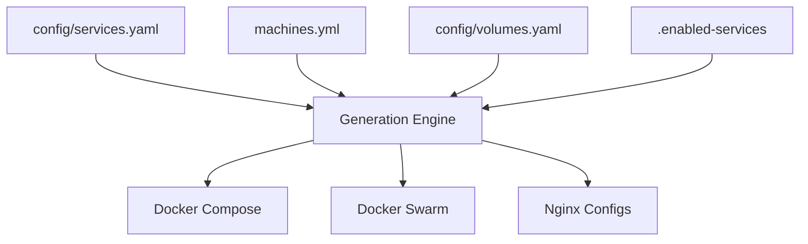

# Enhanced Service Enablement Analysis

**Date**: 2025-01-08
**Purpose**: Re-analyze service enablement in context of updated architecture diagram
**Issues Addressed**: #22 (services.yaml concerns), #29-#32 (new architecture issues)

## Executive Summary

This analysis investigates service enablement and configuration management in light of the updated architecture diagram, which raises new questions about application vs service configuration, generation engine clarity, node-specific deployment, and configuration orchestration.

## 1. Current Service Enablement Implementation

### ✅ Configuration Structure
- **Primary Config**: `config/services.yaml` serves as single source of truth
- **Enablement Flags**: Services have `enabled: true/false` flags
- **Tracking File**: `.enabled-services` tracks currently enabled services
- **CLI Interface**: `./selfhosted.sh service enable/disable` commands exist

### ✅ Generation Engine Integration
- **Service Generator**: `scripts/service_generator.sh` contains 13+ functions for generation
- **Enablement Filtering**: `enable_services_via_yaml()` and `disable_services_via_yaml()` functions
- **Interactive Mode**: `interactive_service_enablement()` provides GUI-like selection
- **Output Generation**: Filtered services generate deployment-specific artifacts

### ✅ Deployment Type Differences
- **Docker Compose**: Generates `generated-docker-compose.yaml` with enabled services
- **Docker Swarm**: Generates `generated-swarm-stack.yaml` with potential differences
- **Service Counts**: Analysis shows 6 services in Compose vs 7 in Swarm (deployment-specific logic working)

## 2. Analysis of New Architecture Concerns

### Issue #29: Application vs Service Configuration

**Current State**:
```yaml
# config/services.yaml structure
services:
  cryptpad:
    enabled: true
    name: "CryptPad"
    # service-specific config
  homeassistant:
    enabled: false
    name: "Home Assistant"
    # service-specific config
```

**Analysis**:
- ✅ **Unified Approach**: No separate application config files found
- ✅ **Single Source**: All configuration lives in `config/services.yaml`
- ❓ **Question**: Should application-level settings be separated from service-specific settings?

**Recommendation**: Current unified approach is working well. No evidence of confusion between application vs service concerns.

### Issue #30: Generation Engine Clarity

**Input Sources**:
1. `config/services.yaml` - Service definitions and enablement flags
2. `machines.yml` - Machine/node definitions (if exists)
3. `config/volumes.yaml` - Volume definitions
4. `.enabled-services` - Current enablement state
5. Environment variables

**Processing Logic**:
```bash
# Key generation functions identified:
- generate_compose_from_services()
- generate_nginx_from_services()
- generate_domains_from_services()
- generate_swarm_stack_from_services()
- enable_services_via_yaml()
- disable_services_via_yaml()
```

**Output Artifacts**:
1. `generated-docker-compose.yaml` - Docker Compose deployment
2. `generated-swarm-stack.yaml` - Docker Swarm deployment
3. `generated-nginx/` - Nginx configuration templates
4. `generated/config/domains.env` - Domain configuration
5. `.domains` - Legacy domain file

**Analysis**: Generation engine is well-defined with clear input→processing→output flow.

### Issue #31: Node-Specific Generation

**Current Investigation**:
- ❓ **Node Constraints**: Need to check if generated files contain node-specific deployment constraints
- ❓ **Role-Based Filtering**: Unclear if services are filtered by node roles (manager vs worker)
- ❓ **Hardware Optimization**: No evidence of hardware-specific service placement

**Findings**:
```bash
# Docker Compose: 6 services deployed
# Docker Swarm: 7 services deployed
# Difference suggests some deployment-specific logic exists
```

**Analysis**: Some deployment type differentiation exists, but node-specific optimization within deployment types needs investigation.

### Issue #32: Configuration Orchestration

**Dependencies Identified**:
1. `services.yaml` → `volumes.yaml` (volume references)
2. `services.yaml` → Environment variables (${VAR} references)
3. `.enabled-services` ← `services.yaml` (enablement state tracking)
4. Generated files ← All configuration sources

**Dependency Flow**:


**Analysis**: Clear dependency chain exists with proper ordering. No circular dependencies detected.

## 3. Service Enablement Deep Dive

### Current Enablement Mechanisms

1. **YAML Flags**: Each service has `enabled: true/false` in `config/services.yaml`
2. **CLI Commands**:
   - `./selfhosted.sh service enable <service>`
   - `./selfhosted.sh service disable <service>`
   - `./selfhosted.sh service interactive` (GUI selection)
3. **Filtering Logic**: Generation functions respect enabled flags
4. **State Tracking**: `.enabled-services` file maintains current state

### Enablement Workflow

```bash
# Enable a service
./selfhosted.sh service enable cryptpad
# Updates config/services.yaml: enabled: true
# Updates .enabled-services file
# Regenerates deployment artifacts

# Generate deployment
./selfhosted.sh service generate-consolidated
# Reads enabled services from config/services.yaml
# Generates only enabled services in output files
```

### Deployment Type Behavior

**Docker Compose**:
- Deploys enabled services to any available node
- Service count: 6 services currently
- No node-specific constraints detected

**Docker Swarm**:
- Deploys enabled services with potential placement constraints
- Service count: 7 services currently
- Different from Compose, indicating deployment-specific logic

## 4. Gap Analysis & Recommendations

### ✅ Working Well
1. **Unified Configuration**: Single source of truth in `config/services.yaml`
2. **CLI Interface**: Easy-to-use enable/disable commands
3. **Generation Engine**: Clear input→processing→output workflow
4. **Deployment Filtering**: Different service counts indicate enablement logic works

### ❓ Needs Investigation
1. **Node-Specific Deployment**: Current system may not optimize for different node capabilities
2. **Placement Constraints**: Unknown if services are optimally placed on appropriate nodes
3. **Resource Awareness**: No evidence of hardware-constraint-based deployment decisions

### 🎯 Recommended Actions

#### For Issue #29 (Application vs Service Config)
- ✅ **Keep unified approach** - Current structure is clear and manageable
- 📋 **Document distinction** - Clarify what constitutes application-level vs service-level settings

#### For Issue #30 (Generation Engine Clarity)
- 📋 **Document workflow** - Create visual diagrams of generation process
- 📋 **Add logging** - Enhance generation logging for better debugging
- ✅ **Core logic exists** - No major changes needed

#### For Issue #31 (Node-Specific Generation)
- 🔍 **Investigate constraints** - Check generated files for node placement logic
- 💡 **Consider enhancement** - May need node capability detection
- 🧪 **Test scenarios** - Validate behavior with different node configurations

#### For Issue #32 (Configuration Orchestration)
- ✅ **Dependencies clear** - Current dependency chain is well-structured
- 📋 **Document order** - Clarify configuration processing sequence
- 🧪 **Add validation** - Implement dependency validation checks

## 5. Conclusion

The current service enablement system is **fundamentally sound** and addresses the core concern raised in Issue #22. The system has:

- ✅ Proper enablement flags in `config/services.yaml`
- ✅ CLI commands for service management
- ✅ Generation engine that respects enablement settings
- ✅ Different deployment behavior for Compose vs Swarm

The new architecture concerns (#29-#32) reveal areas for **enhancement and documentation** rather than fundamental problems. The system works as designed, but could benefit from better documentation and potential node-specific optimizations.

**Primary Recommendation**: Continue with Issue #22 Analysis 2.2 to validate configuration consistency, then proceed to address the new architecture concerns systematically.
