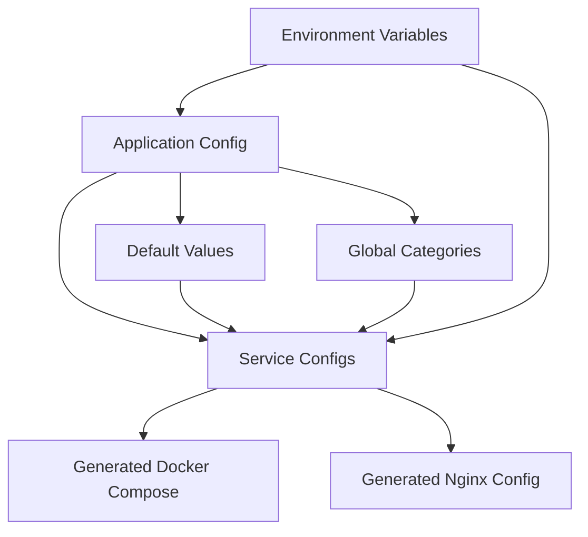

# Application vs Service Configuration Analysis

**Date**: 2025-01-08
**Purpose**: Analysis 9.1 - Define application vs service configuration distinction
**Issue**: [#29](https://github.com/chutch3/selfhosted.sh/issues/29) - Application vs Service Configuration

## Executive Summary

This analysis examines the distinction between application-level configuration and service-specific configuration in the homelab system, determines clear boundaries, and assesses whether the current unified approach should be maintained or if separation would be beneficial.

## 1. Current Configuration Architecture

### 📋 Configuration File Structure

```
homelab/
├── config/
│   ├── services.yaml          # Combined app + service configuration
│   ├── volumes.yaml           # Storage/volume configuration
│   └── machines.yml.example   # Multi-node infrastructure
├── .env (user created)        # Environment variables
└── .env.example               # Environment template
```

### 🔍 Analysis of `config/services.yaml` Structure

The current `config/services.yaml` contains **both** application and service concerns:

#### Application-Level Configuration (Lines 1-16)
```yaml
version: '1.0'

# Application-level categories
categories:
  core: Core Infrastructure
  finance: Finance & Budgeting
  media: Media Management
  collaboration: Collaboration & Productivity
  automation: Smart Home & Automation
  development: Development & Management

# Application-level defaults
defaults:
  domain_pattern: ${service}.${BASE_DOMAIN}
  restart_policy: unless-stopped
  networks:
    - reverseproxy
  nginx:
    ssl_config: /etc/nginx/conf.d/includes/ssl
    proxy_config: /etc/nginx/conf.d/includes/proxy
```

#### Service-Specific Configuration (Lines 17+)
```yaml
services:
  homepage:
    name: Homepage Dashboard
    description: Centralized dashboard for all services
    category: core                    # References app-level categories
    domain: dashboard
    port: 3000
    compose: {...}                    # Service-specific container config
    nginx: {...}                      # Service-specific proxy config
    enabled: true                     # Service-specific enablement
```

## 2. Configuration Concern Analysis

### ✅ Application-Level Concerns

**Definition**: Configuration that applies system-wide or affects multiple services

**Current Implementation**:
1. **Global Categories**: Service categorization schema
2. **Default Behaviors**: Common settings inherited by all services
3. **Network Configuration**: Shared networking (reverseproxy)
4. **SSL/Proxy Defaults**: Common nginx configuration patterns
5. **Domain Patterns**: System-wide domain templating

**Examples**:
```yaml
# Application-level: affects all services
defaults:
  domain_pattern: ${service}.${BASE_DOMAIN}
  restart_policy: unless-stopped
  networks: [reverseproxy]

# Application-level: categorization system
categories:
  media: Media Management
  finance: Finance & Budgeting
```

### ✅ Service-Specific Concerns

**Definition**: Configuration unique to individual services

**Current Implementation**:
1. **Container Configuration**: Docker images, ports, volumes, environment
2. **Service Metadata**: Names, descriptions, categories (reference)
3. **Deployment Settings**: Service-specific overrides and constraints
4. **Nginx Configuration**: Service-specific proxy rules
5. **Enablement State**: Individual service on/off flags

**Examples**:
```yaml
# Service-specific: unique to homepage service
homepage:
  name: Homepage Dashboard           # Service identity
  port: 3000                        # Service networking
  compose:                          # Service container config
    image: ghcr.io/gethomepage/homepage:latest
    container_name: homepage
  nginx:                           # Service proxy config
    upstream: homepage:3000
  enabled: true                    # Service state
```

## 3. Separation of Concerns Assessment

### 🔍 Current Approach: Unified Configuration

**Benefits** ✅:
- **Single Source of Truth**: All configuration in one file
- **Relationship Clarity**: Service configs can reference app-level defaults
- **Inheritance**: Services inherit from application defaults
- **Simplicity**: One file to edit and maintain
- **Atomic Changes**: Application and service changes can be coordinated

**Potential Issues** ❓:
- **File Size**: Growing service count increases file size
- **Scope Confusion**: Mixing application and service concerns
- **Change Blast Radius**: Application changes affect service file
- **Role Clarity**: Unclear who manages what parts

### 🔍 Alternative: Separated Configuration

**Hypothetical Structure**:
```
config/
├── application.yaml        # App-level config only
├── services/
│   ├── core.yaml          # Core services
│   ├── media.yaml         # Media services
│   └── finance.yaml       # Finance services
└── volumes.yaml           # Storage config
```

**Benefits** ✅:
- **Clear Boundaries**: Obvious separation of concerns
- **Modular Structure**: Services grouped by category
- **Independent Changes**: App vs service changes isolated
- **Role Assignment**: Different teams could manage different files

**Drawbacks** ❌:
- **Relationship Complexity**: Cross-references between files
- **Consistency Risk**: Harder to maintain consistent patterns
- **Generation Complexity**: More files to process and merge
- **Migration Effort**: Significant restructuring required

## 4. Cross-File Configuration Analysis

### 📂 Supporting Configuration Files

#### `config/volumes.yaml` (Storage Configuration)
```yaml
# Application-level storage concerns
storage:
  local:
    enabled: true
    base_path: "${PROJECT_ROOT:-./}/appdata"
  nfs:
    enabled: false
    server: "192.168.1.100"

# Application-level volume defaults
volume_types:
  application_data:
    backup_priority: "high"
```

**Analysis**: ✅ Properly separated - storage infrastructure is clearly application-level

#### `machines.yml.example` (Infrastructure Configuration)
```yaml
# Application-level infrastructure
managers:
  - hostname: manager-1
    ip: 192.168.1.10
workers:
  - hostname: worker-1
    ip: 192.168.1.11
```

**Analysis**: ✅ Properly separated - machine infrastructure is clearly application-level

#### `.env` (Environment Configuration)
```bash
# Application-level environment
BASE_DOMAIN=yourdomain.com
UID=1000
GID=1000

# Service-specific environment (auto-generated)
DOMAIN_HOMEPAGE=dashboard.yourdomain.com
```

**Analysis**: ✅ Mixed but logical - base settings are app-level, service domains are derived

## 5. Industry Best Practices Analysis

### 🏗️ Configuration Architecture Patterns

#### Pattern 1: Monolithic Configuration (Current)
**Examples**: Docker Compose, Kubernetes manifests
- **Pro**: Simple, atomic, clear relationships
- **Con**: Can become large and complex

#### Pattern 2: Hierarchical Configuration
**Examples**: Ansible, Terraform
- **Pro**: Clear structure, modular
- **Con**: Complex relationships, harder to reason about

#### Pattern 3: Convention over Configuration
**Examples**: Ruby on Rails, Spring Boot
- **Pro**: Minimal configuration, sane defaults
- **Con**: Less flexibility, implicit behavior

### 📊 Assessment for Homelab Context

**Current System Analysis**:
- **Scale**: 9 services currently (manageable in single file)
- **Complexity**: Medium (application defaults + service specifics)
- **User Base**: Individual users/families (not enterprise teams)
- **Change Frequency**: Low to medium (home lab evolution)

**Recommendation**: ✅ **Monolithic approach appropriate** for this scale and context

## 6. Configuration Relationship Mapping

### 🔗 Dependency Flow Analysis



### 📋 Relationship Types

1. **Inheritance**: Services inherit from application defaults
2. **Reference**: Services reference application categories
3. **Template**: Application domain patterns template service domains
4. **Override**: Services can override application defaults
5. **Generation**: Both contribute to generated artifacts

## 7. Clear Boundary Definition

### ✅ Application Configuration Scope

**Owns**:
- Global categories and taxonomies
- Default behaviors and inheritance patterns
- System-wide networking and security policies
- Domain and naming conventions
- Cross-service configuration patterns

**Examples**:
```yaml
# Application-level: system taxonomy
categories:
  media: Media Management

# Application-level: inheritance defaults
defaults:
  restart_policy: unless-stopped
  networks: [reverseproxy]
```

### ✅ Service Configuration Scope

**Owns**:
- Individual service identity and metadata
- Container configuration and deployment settings
- Service-specific networking and storage
- Service enablement and lifecycle management
- Service-specific overrides and customizations

**Examples**:
```yaml
# Service-level: individual identity
homepage:
  name: Homepage Dashboard
  enabled: true

# Service-level: specific deployment
  compose:
    image: ghcr.io/gethomepage/homepage:latest
    ports: ["3001:3000"]
```

## 8. Recommendations

### ✅ Maintain Current Unified Approach

**Rationale**:
1. **Appropriate Scale**: 9 services manageable in single file
2. **Clear Relationships**: Application defaults and service specifics work well together
3. **Proven Functionality**: Current approach working without issues
4. **User Simplicity**: Single file easier for home lab users
5. **Atomic Operations**: Changes can be coordinated across app and service levels

### 🎯 Enhancement Opportunities

While maintaining unified structure, improve clarity:

#### 1. Enhanced Documentation
```yaml
# config/services.yaml
# ===========================================
# APPLICATION-LEVEL CONFIGURATION
# ===========================================
version: '1.0'

# Global service categories (application-level)
categories:
  media: Media Management

# System-wide defaults (application-level)
defaults:
  restart_policy: unless-stopped

# ===========================================
# SERVICE-SPECIFIC CONFIGURATION
# ===========================================
services:
  # Individual service definitions (service-level)
```

#### 2. Validation Schema
- Define JSON schema with clear application vs service sections
- Add validation for proper scope usage
- Prevent service-level configs in application section

#### 3. Generation Logic Clarity
- Document how application defaults merge with service specifics
- Ensure override precedence is clear and consistent
- Add logging to show inheritance chain

## 9. Conclusion

**✅ Analysis 9.1 COMPLETED**: Application vs service configuration distinction clearly defined.

### Key Findings

1. **Current Structure Works**: Unified approach appropriate for scale and context
2. **Clear Boundaries Exist**: Application vs service concerns are distinguishable
3. **Logical Organization**: Categories, defaults, and inheritance patterns make sense
4. **Industry Alignment**: Monolithic config appropriate for home lab scale

### Boundary Definition

- **Application Config**: Categories, defaults, patterns, system-wide policies
- **Service Config**: Individual service identity, containers, enablement, overrides

### Recommendation

✅ **Maintain unified approach** with enhanced documentation and validation rather than restructuring. The current system successfully balances simplicity with flexibility for the home lab use case.

**Next Steps**: Proceed with Analysis 9.2 to validate these boundaries are properly enforced.
