# Configuration Dependencies Mapping

**Date**: 2025-01-08
**Updated**: 2025-01-08 (Corrected for deployment type exclusivity)
**Purpose**: Analysis 12.1 - Identify all configuration relationships and dependencies
**Issue**: [#32](https://github.com/chutch3/selfhosted.sh/issues/32) - Configuration Orchestration

## Executive Summary

This analysis maps all configuration relationships and dependencies within the selfhosted system, identifying how different configuration files, environment variables, and generated artifacts depend on each other. **Critical Context**: Deployment types are mutually exclusive - only one deployment type (Docker Compose OR Docker Swarm OR Kubernetes) is used at a time, not simultaneously.

## 1. Configuration File Inventory

### 📋 Primary Configuration Files

#### Core Configuration Sources:
```yaml
# Primary configuration hierarchy
configuration_files:
  primary_configs:
    - path: "config/services.yaml"
      type: "Service Definitions"
      scope: "Application services and their configurations"
      format: "YAML"
      validation: "Schema-based"

    - path: ".env"
      type: "Environment Variables"
      scope: "Global deployment variables"
      format: "Key=Value pairs"
      validation: "Manual"

    - path: "config/volumes.yaml"
      type: "Storage Configuration"
      scope: "Volume and storage definitions"
      format: "YAML"
      validation: "Schema-based"

    - path: "machines.yml"
      type: "Infrastructure Definition"
      scope: "Node and cluster topology"
      format: "YAML"
      validation: "Manual"
```

#### Template and Static Files:
```yaml
# Template and static configuration sources
static_configs:
  - path: "config/services/reverseproxy/templates/"
    type: "Nginx Templates"
    scope: "Reverse proxy configuration templates"
    dependency_source: "config/services.yaml"

  - path: "config/services/homeassistant/"
    type: "Service-Specific Config"
    scope: "Individual service configurations"
    dependency_source: "Generated environment variables"
```

### 🔍 Configuration Schema Analysis

#### config/services.yaml Structure:
```yaml
# Configuration schema dependencies
services_yaml_schema:
  version: "String - Configuration version"
  categories:
    type: "Object - Service categorization"
    dependencies: []

  defaults:
    type: "Object - Application-wide defaults"
    dependencies: []
    provides: ["Default values for all services"]

  services:
    type: "Object - Service definitions"
    dependencies:
      - "defaults (inheritance)"
      - ".env (domain patterns)"
      - "config/volumes.yaml (volume definitions)"
    provides: ["Service configurations", "Enablement flags"]
```

## 2. Dependency Relationship Mapping

### 🔄 Direct Dependencies

#### Primary Dependency Chains:

```mermaid
graph TD
    subgraph "📂 Configuration Sources"
        A[.env<br/>Environment Variables]
        B[config/services.yaml<br/>Service Definitions]
        C[config/volumes.yaml<br/>Storage Configuration]
        D[machines.yml<br/>Infrastructure]
    end

    subgraph "🔄 Processing Dependencies"
        E[Domain Pattern Expansion<br/>Requires .env + services.yaml]
        F[Volume Resolution<br/>Requires volumes.yaml + services.yaml]
        G[Service Inheritance<br/>Requires services.yaml defaults]
        H[Node Selection<br/>Requires machines.yml + services.yaml]
    end

    subgraph "📦 Generated Artifacts"
        I[generated-docker-compose.yaml<br/>Depends on E,F,G]
        J[generated-swarm-stack.yaml<br/>Depends on E,F,G,H]
        K[generated-nginx/<br/>Depends on E,G]
        L[.domains<br/>Depends on E]
    end

    A --> E
    B --> E
    B --> G
    C --> F
    B --> F
    D --> H
    B --> H

    E --> I
    F --> I
    G --> I

    E --> J
    F --> J
    G --> J
    H --> J

    E --> K
    G --> K

    E --> L

    style A fill:#e1f5fe
    style B fill:#e8f5e8
    style C fill:#f3e5f5
    style D fill:#fff3e0
```


#### Detailed Dependency Analysis:

##### .env Dependencies:
```bash
# .env provides foundation variables
env_dependencies:
  provides:
    - BASE_DOMAIN: "Used in domain pattern expansion"
    - PROJECT_ROOT: "Used in volume path resolution"
    - COMPOSE_PROJECT_NAME: "Docker Compose project naming"
    - Various service-specific variables

  consumed_by:
    - "Domain pattern expansion (${BASE_DOMAIN})"
    - "Volume path resolution (${PROJECT_ROOT})"
    - "Service configuration templates"
    - "Generated environment files"

  dependency_type: "Foundation - Required by all other processing"
```

##### config/services.yaml Dependencies:
```yaml
# services.yaml dependency relationships
services_yaml_dependencies:
  depends_on:
    - ".env":
        fields: ["BASE_DOMAIN"]
        usage: "Domain pattern expansion"
        example: "${service}.${BASE_DOMAIN}"

    - "config/volumes.yaml":
        fields: ["volume definitions"]
        usage: "Volume reference resolution"
        example: "volumes.application_data"

    - "External templates":
        files: ["nginx/*.template"]
        usage: "Service-specific configuration templates"

  provides:
    - "Service definitions": "Complete service configurations"
    - "Enablement flags": "Service activation control"
    - "Default values": "Application-wide configuration defaults"
    - "Domain patterns": "URL and domain generation rules"

  internal_dependencies:
    - "defaults → services": "Default value inheritance"
    - "categories → services": "Service categorization"
    - "enabled flags → generation": "Service filtering"
```

##### config/volumes.yaml Dependencies:
```yaml
# volumes.yaml dependency relationships
volumes_yaml_dependencies:
  depends_on:
    - ".env":
        fields: ["PROJECT_ROOT"]
        usage: "Base path resolution for local storage"
        example: "${PROJECT_ROOT}/appdata"

  provides:
    - "Storage configurations": "Volume type definitions"
    - "Backup priorities": "Data protection levels"
    - "Permission settings": "Access control specifications"

  consumed_by:
    - "config/services.yaml": "Volume references in service definitions"
    - "Docker Compose generation": "Volume mount specifications"
    - "Backup scripts": "Priority-based backup scheduling"
```

##### machines.yml Dependencies:
```yaml
# machines.yml dependency relationships
machines_yml_dependencies:
  depends_on: []  # Independent configuration file

  provides:
    - "Node topology": "Manager and worker node definitions"
    - "SSH access": "Remote management credentials"
    - "Node labels": "Deployment constraint labels"
    - "Infrastructure inventory": "Complete cluster specification"

  consumed_by:
    - "Docker Swarm generation": "Node-specific deployment constraints"
    - "SSH management scripts": "Remote access and deployment"
    - "Cluster initialization": "Multi-node setup automation"
```

### 🔗 Indirect Dependencies

#### Cross-Configuration Relationships:
```yaml
# Complex dependency relationships
indirect_dependencies:
  service_enablement_chain:
    trigger: "services.yaml enabled flag change"
    cascades:
      - "Domain generation filtering"
      - "Nginx template generation filtering"
      - "Docker Compose service inclusion"
      - "Environment variable generation"
    impact: "Multiple artifact regeneration required"

  domain_pattern_chain:
    trigger: ".env BASE_DOMAIN change"
    cascades:
      - "All service domain regeneration"
      - "Nginx template URL updates"
      - "Environment variable updates"
      - "External DNS configuration updates"
    impact: "Full system regeneration required"

  volume_configuration_chain:
    trigger: "volumes.yaml storage path change"
    cascades:
      - "Service volume mount updates"
      - "Docker Compose volume definitions"
      - "Backup script path updates"
      - "Data migration requirements"
    impact: "Service restart and data migration required"
```

## 3. Generation Process Dependencies

### 🔧 Generator Function Dependencies

#### Service Generator Dependencies:
```bash
# scripts/service_generator.sh dependency analysis
service_generator_dependencies:
  input_files:
    required:
      - "config/services.yaml": "Primary service definitions"
      - ".env": "Environment variable expansion"
    optional:
      - "config/volumes.yaml": "Volume configuration (if volumes used)"
      - "machines.yml": "Node information (for Swarm generation)"

  processing_dependencies:
    step_1: "Load and validate services.yaml"
    step_2: "Filter enabled services (depends on step 1)"
    step_3: "Apply default inheritance (depends on step 1)"
    step_4: "Expand domain patterns (depends on .env + step 3)"
    step_5: "Generate target artifacts (depends on all previous)"

  output_files:
    generated:
      - "generated-docker-compose.yaml"
      - "generated-swarm-stack.yaml"
      - "generated-nginx/*.template"
      - ".domains"
```

#### Domain Generation Dependencies:
```bash
# Domain generation dependency chain
domain_generation_chain:
  input_requirements:
    - "BASE_DOMAIN from .env": "Foundation domain"
    - "Service keys from services.yaml": "Service identification"
    - "Domain patterns from services.yaml": "Pattern templates"

  processing_order:
    1. "Load BASE_DOMAIN environment variable"
    2. "Extract service keys from enabled services"
    3. "Get domain pattern for each service"
    4. "Perform variable substitution (${service}, ${BASE_DOMAIN})"
    5. "Generate domain environment variables"
    6. "Write .domains file"

  output_dependencies:
    - "Nginx template generation": "Uses generated domain variables"
    - "Docker Compose environment": "Includes domain variables"
    - "External service configuration": "References generated domains"
```

### 📊 Dependency Ordering Requirements

#### Generation Order Requirements:
```yaml
# Required processing order to satisfy dependencies
generation_order:
  phase_1_validation:
    order: 1
    description: "Validate all input configuration files"
    dependencies: []
    files: [".env", "config/services.yaml", "config/volumes.yaml", "machines.yml"]

  phase_2_environment:
    order: 2
    description: "Load and validate environment variables"
    dependencies: ["phase_1_validation"]
    critical_vars: ["BASE_DOMAIN", "PROJECT_ROOT"]

  phase_3_service_discovery:
    order: 3
    description: "Discover and filter enabled services"
    dependencies: ["phase_1_validation"]
    input: "config/services.yaml"

  phase_4_domain_generation:
    order: 4
    description: "Generate domain patterns and variables"
    dependencies: ["phase_2_environment", "phase_3_service_discovery"]
    output: ".domains"

  phase_5_artifact_generation:
    order: 5
    description: "Generate deployment artifacts"
    dependencies: ["phase_4_domain_generation"]
    outputs: ["docker-compose.yaml", "swarm-stack.yaml", "nginx templates"]
```

## 4. Configuration Validation Dependencies

### 🔍 Validation Relationship Requirements

#### Cross-Configuration Validation Needs:
```yaml
# Validation dependencies between configurations
validation_dependencies:
  service_volume_validation:
    description: "Ensure service volume references exist in volumes.yaml"
    files: ["config/services.yaml", "config/volumes.yaml"]
    validation: "Each service volume reference must have corresponding definition"
    example: |
      services.homepage.volumes.config → volumes.volume_types.application_data

  domain_pattern_validation:
    description: "Ensure domain patterns can be resolved with available variables"
    files: ["config/services.yaml", ".env"]
    validation: "All domain pattern variables must be defined in environment"
    example: |
      ${service}.${BASE_DOMAIN} requires BASE_DOMAIN in .env

  service_dependency_validation:
    description: "Ensure service dependencies are enabled and available"
    files: ["config/services.yaml"]
    validation: "Services with dependencies must reference enabled services"
    example: |
      Service A depends on reverse_proxy → reverse_proxy must be enabled

  machine_label_validation:
    description: "Ensure service placement constraints match available node labels"
    files: ["config/services.yaml", "machines.yml"]
    validation: "Placement constraints must reference existing node labels"
    example: |
      constraint: node.role == manager → machines.yml must define manager nodes
```

#### Validation Order Requirements:
```yaml
# Required validation sequence
validation_order:
  1_syntax_validation:
    description: "Validate YAML syntax and structure"
    files: ["All YAML files"]
    dependencies: []

  2_schema_validation:
    description: "Validate against configuration schemas"
    files: ["config/services.yaml", "config/volumes.yaml"]
    dependencies: ["1_syntax_validation"]

  3_reference_validation:
    description: "Validate cross-file references"
    dependencies: ["2_schema_validation"]
    checks:
      - "Service volume references"
      - "Domain pattern variables"
      - "Service dependencies"

  4_constraint_validation:
    description: "Validate deployment constraints"
    dependencies: ["3_reference_validation"]
    checks:
      - "Node placement constraints"
      - "Resource requirements"
      - "Architecture compatibility"
```

## 5. Environment Variable Dependencies

### 🌐 Environment Variable Flow

#### Variable Dependency Chains:
```bash
# Environment variable dependency mapping
environment_dependencies:
  foundation_variables:
    BASE_DOMAIN:
      source: ".env"
      consumed_by:
        - "Domain pattern expansion"
        - "Nginx template generation"
        - "External service URLs"
      propagation: "Global - affects all services"

    PROJECT_ROOT:
      source: ".env"
      consumed_by:
        - "Volume path resolution"
        - "Generated file paths"
        - "Backup script paths"
      propagation: "Infrastructure - affects storage and paths"

  generated_variables:
    service_domains:
      source: "Domain generation process"
      pattern: "${SERVICE_NAME}_DOMAIN"
      consumed_by:
        - "Nginx template configuration"
        - "Service environment variables"
        - "External integrations"
      examples: ["HOMEPAGE_DOMAIN", "ACTUAL_DOMAIN"]

  service_specific_variables:
    per_service_vars:
      source: "config/services.yaml compose.environment"
      scope: "Individual service configuration"
      consumed_by: "Docker container environment"
      dependency: "May reference generated domain variables"
```

### 📋 Variable Resolution Order

#### Resolution Dependency Chain:
```yaml
# Environment variable resolution order
variable_resolution_order:
  1_foundation_loading:
    source: ".env file"
    variables: ["BASE_DOMAIN", "PROJECT_ROOT", "COMPOSE_PROJECT_NAME"]
    validation: "Required variables must be present"

  2_domain_generation:
    depends_on: ["1_foundation_loading"]
    process: "Generate service-specific domain variables"
    output: "SERVICENAME_DOMAIN variables"

  3_service_environment:
    depends_on: ["1_foundation_loading", "2_domain_generation"]
    process: "Merge service-specific environment with generated variables"
    output: "Complete service environment configuration"

  4_template_substitution:
    depends_on: ["3_service_environment"]
    process: "Replace template variables with resolved values"
    output: "Final configuration files"
```

## 6. Temporal Dependencies

### ⏰ Configuration Change Propagation

#### Change Impact Analysis:
```yaml
# Configuration change temporal dependencies
change_propagation:
  env_file_change:
    triggers:
      - "BASE_DOMAIN change"
      - "PROJECT_ROOT change"
    immediate_impact:
      - "Domain variable regeneration required"
      - "All artifact regeneration required"
    cascade_impact:
      - "Service restart required (new domains)"
      - "External DNS updates required"
      - "SSL certificate updates may be required"
    timing: "Immediate propagation required"

  services_yaml_change:
    triggers:
      - "Service enablement change"
      - "Service configuration change"
      - "New service addition"
    immediate_impact:
      - "Affected service artifacts regeneration"
      - "Nginx template updates"
    cascade_impact:
      - "Reverse proxy configuration reload"
      - "Service deployment/undeployment"
    timing: "Service-specific propagation"

  volumes_yaml_change:
    triggers:
      - "Volume configuration change"
      - "Storage path change"
    immediate_impact:
      - "Volume mount configuration updates"
      - "Service restart required"
    cascade_impact:
      - "Data migration may be required"
      - "Backup path updates"
    timing: "Careful sequencing required (data safety)"
```

#### Update Sequencing Requirements:
```yaml
# Required update sequence for configuration changes
update_sequencing:
  safe_update_order:
    1_backup_current:
      description: "Backup current configuration and data"
      purpose: "Enable rollback if issues occur"

    2_validate_new:
      description: "Validate new configuration against dependencies"
      purpose: "Prevent invalid configuration deployment"

    3_update_configs:
      description: "Update configuration files"
      purpose: "Apply new configuration"

    4_regenerate_artifacts:
      description: "Regenerate affected deployment artifacts"
      purpose: "Update generated files to reflect configuration changes"

    5_deploy_changes:
      description: "Deploy updated artifacts"
      purpose: "Apply changes to running system"

    6_verify_operation:
      description: "Verify system operation with new configuration"
      purpose: "Ensure changes applied successfully"
```

## 7. Dependency Risk Analysis

### ⚠️ Circular Dependency Risks

#### Potential Circular Dependencies:
```yaml
# Identified circular dependency risks
circular_dependency_risks:
  service_domain_circular:
    risk_scenario: "Service A domain depends on Service B, Service B depends on Service A"
    current_status: "Low risk - domain generation is one-way"
    mitigation: "Domain patterns are resolved independently"

  volume_service_circular:
    risk_scenario: "Volume config depends on service, service depends on volume"
    current_status: "Medium risk - volume references are bidirectional"
    mitigation: "Volume definitions are independent of service state"

  template_generation_circular:
    risk_scenario: "Template depends on generated config, config depends on template"
    current_status: "Low risk - templates are input-only"
    mitigation: "Templates are static inputs, not generated outputs"
```

### 🔧 Dependency Failure Handling

#### Failure Impact Analysis:
```yaml
# Dependency failure scenarios and impacts
failure_scenarios:
  missing_env_file:
    impact: "Complete generation failure"
    affected_systems: "All artifact generation"
    recovery: "Restore .env file or provide required variables"

  invalid_services_yaml:
    impact: "Service-specific generation failure"
    affected_systems: "Affected services only"
    recovery: "Fix YAML syntax errors"

  missing_volume_reference:
    impact: "Service deployment failure"
    affected_systems: "Services with invalid volume references"
    recovery: "Fix volume references or add volume definitions"

  domain_generation_failure:
    impact: "Template and environment generation failure"
    affected_systems: "Nginx templates, domain variables"
    recovery: "Fix domain patterns or environment variables"
```

## 8. Conclusion

**✅ Analysis 12.1 COMPLETED**: Configuration dependencies comprehensively mapped and analyzed.

### Key Findings

1. **Complex Dependency Web**: 4 primary configuration files with multiple interdependencies
2. **Clear Hierarchy**: .env → services.yaml → generated artifacts forms primary dependency chain
3. **Cross-File Validation Needs**: Multiple validation points required between configuration files
4. **Temporal Dependencies**: Configuration changes require careful sequencing and propagation
5. **Low Circular Risk**: Current architecture has minimal circular dependency risk

### Dependency Summary

#### Primary Dependencies:
- **Foundation**: .env provides base variables for all other processing
- **Central Hub**: config/services.yaml depends on .env and provides configuration for all generation
- **Storage Layer**: config/volumes.yaml provides volume definitions consumed by services
- **Infrastructure**: machines.yml provides node information for deployment

#### Critical Relationships:
- **Domain Generation**: Requires .env (BASE_DOMAIN) + services.yaml (patterns)
- **Service Configuration**: Requires defaults inheritance + environment expansion
- **Artifact Generation**: Requires complete dependency chain resolution

### Orchestration Requirements

1. **Validation Order**: Syntax → Schema → References → Constraints
2. **Generation Order**: Environment → Discovery → Domains → Artifacts
3. **Change Propagation**: Immediate for critical variables, service-specific for others
4. **Failure Handling**: Graceful degradation with clear error messages

**Next Step**: Proceed with Analysis 12.2 - Environment-specific overrides investigation.
