# System Architecture

This document describes the modern architecture of the selfhosted system after completing all phases of modernization.

## Architecture Overview

The system has evolved from a fragmented collection of scripts and static files into a unified, modern architecture centered around `config/services.yaml` as the single source of truth.

```mermaid
graph TB
    subgraph "🎯 Modern Selfhosted System"
        subgraph "📁 Source Configuration"
            CONFIG["📄 config/services.yaml<br/>🏆 SINGLE SOURCE OF TRUTH<br/>• Service definitions & metadata<br/>• Container configurations<br/>• Domain patterns & nginx config<br/>• enabled: true/false flags<br/>• Multi-platform overrides"]
        end

        subgraph "🎮 Modern CLI Interface"
            CLI["🖥️ ./selfhosted service<br/>✅ list - Browse available services<br/>✅ enable/disable - Control services<br/>✅ status - View enabled services<br/>✅ interactive - GUI selection<br/>✅ generate - Create deployment files<br/>✅ info - Service details<br/>✅ validate - Check configuration"]
        end

        subgraph "⚙️ Generation Engine"
            GENERATOR["🔧 scripts/service_generator.sh<br/>🔄 13 Functions for Complete Automation:<br/>• generate_compose_from_services()<br/>• generate_nginx_from_services()<br/>• generate_domains_from_services()<br/>• generate_swarm_stack_from_services()<br/>• enable_services_via_yaml()<br/>• migrate_from_legacy_enabled_services()<br/>• generate_all_to_generated_dir()<br/>• And 6 more..."]
        end

        subgraph "🏗️ Generated Structure"
            GENDIR["📁 generated/<br/>🎨 Clean, Organized Structure"]
            DEPLOYMENTS["📦 generated/deployments/<br/>• docker-compose.yaml<br/>• swarm-stack.yaml"]
            NGINX_GEN["🌐 generated/nginx/templates/<br/>• actual.template<br/>• homepage.template<br/>• cryptpad.template<br/>• All service templates"]
            GENCONFIG["⚙️ generated/config/<br/>• domains.env<br/>• enabled-services.list"]
            README_GEN["📖 generated/README.md<br/>Documentation & Instructions"]
            GITIGNORE["🚫 generated/.gitignore<br/>Version Control Rules"]
        end

        subgraph "🚀 Deployment Targets"
            DCOMPOSE["🐳 Docker Compose<br/>Uses generated/deployments/<br/>docker-compose.yaml"]
            DSWARM["🐝 Docker Swarm<br/>Uses generated/deployments/<br/>swarm-stack.yaml"]
            K8S["☸️ Kubernetes<br/>Ready for generated manifests"]
        end

        subgraph "✅ Quality Assurance"
            TESTS["🧪 152 Comprehensive Tests<br/>• Service generation tests<br/>• Modern enablement tests<br/>• Integration tests<br/>• 100% TDD methodology<br/>• Full coverage achieved"]
        end
    end

    %% Main generation flow
    CONFIG --> GENERATOR
    CLI --> GENERATOR
    GENERATOR --> GENDIR

    %% Generated structure
    GENDIR --> DEPLOYMENTS
    GENDIR --> NGINX_GEN
    GENDIR --> GENCONFIG
    GENDIR --> README_GEN
    GENDIR --> GITIGNORE

    %% Deployment flow
    DEPLOYMENTS --> DCOMPOSE
    DEPLOYMENTS --> DSWARM
    DEPLOYMENTS --> K8S

    %% Testing
    TESTS -.-> GENERATOR
    TESTS -.-> CLI
    TESTS -.-> GENDIR
```



## Core Principles

The architecture follows these fundamental design principles:

### 1. Single Source of Truth
**All configuration lives in one place: `config/services.yaml`**

- Service definitions and metadata
- Container configurations
- Domain patterns and nginx settings
- Service enablement flags
- Platform-specific overrides

### 2. DRY (Don't Repeat Yourself)
**Eliminated 650+ lines of redundant code**

- No duplicate service definitions
- Shared configuration patterns
- Reusable templates and generators

### 3. Separation of Concerns
**Clear boundaries between different system layers**

- **Configuration Layer**: YAML-based service definitions
- **Generation Layer**: Automated file creation
- **Deployment Layer**: Platform-specific orchestration

### 4. Backward Compatibility
**Smooth migration path for existing users**

- Automatic legacy file migration
- Support for both old and new formats
- Gradual deprecation of legacy features

### 5. Test-Driven Development
**152 comprehensive tests ensure reliability**

- Unit tests for all core functions
- Integration tests for end-to-end workflows
- Regression tests prevent breaking changes

## Key Components

### 1. Configuration System (`config/services.yaml`)

The heart of the system - a single YAML file that defines:

```yaml title="config/services.yaml"
version: "1.0"

categories:
  finance: "Finance & Budgeting"
  media: "Media Management"
  # ... more categories

services:
  actual:
    name: "Actual Budget"
    description: "Personal finance and budgeting application"
    category: finance
    domain: "budget"
    port: 5006
    enabled: true  # Modern enablement flag
    
    # Docker Compose configuration
    compose:
      image: "actualbudget/actual-server:latest"
      ports: ["5006:5006"]
      environment:
        - "ACTUAL_UPLOAD_FILE_SYNC_SIZE_LIMIT_MB=20"
      volumes:
        - "./data/actual:/app/data"
    
    # Docker Swarm overrides
    swarm:
      deploy:
        mode: replicated
        replicas: 1
    
    # Nginx reverse proxy configuration
    nginx:
      upstream: "actual_server:5006"
      additional_config: |
        location / {
            proxy_pass http://actual_server:5006;
            proxy_set_header Host $host;
        }
```

### 2. CLI Interface (`selfhosted service`)

Modern command structure with helpful output:

```bash
# Service discovery and management
./selfhosted service list                    # Browse all services
./selfhosted service enable actual homepage  # Enable services
./selfhosted service disable cryptpad        # Disable services
./selfhosted service status                  # View enabled services
./selfhosted service interactive             # Interactive selection

# Generation and validation
./selfhosted service generate                # Generate deployment files
./selfhosted service validate                # Check configuration
./selfhosted service info actual             # Service details
```

### 3. Generation Engine (`scripts/service_generator.sh`)

The core automation engine with 13+ specialized functions:

#### Core Generation Functions
- `generate_compose_from_services()` - Creates Docker Compose files
- `generate_nginx_from_services()` - Generates reverse proxy configs
- `generate_domains_from_services()` - Creates domain environment variables
- `generate_swarm_stack_from_services()` - Generates Swarm stack files

#### Service Management Functions
- `enable_services_via_yaml()` - Modern YAML-based enablement
- `disable_services_via_yaml()` - Modern YAML-based disabling
- `list_enabled_services_from_yaml()` - Query enabled services

#### Migration and Compatibility
- `migrate_from_legacy_enabled_services()` - Auto-migration from legacy
- `generate_legacy_enabled_services()` - Backward compatibility

#### File Organization
- `generate_all_to_generated_dir()` - Clean structure generation
- `cleanup_generated_files()` - File management

### 4. Generated File Structure

The modern `generated/` directory provides clean organization:

```
generated/
├── README.md                    # Auto-generated documentation
├── .gitignore                   # Version control rules
├── deployments/                 # Deployment configurations
│   ├── docker-compose.yaml      # Docker Compose file
│   └── swarm-stack.yaml         # Docker Swarm stack
├── nginx/                       # Nginx configurations
│   └── templates/               # Generated nginx templates
│       ├── actual.template
│       ├── homepage.template
│       └── cryptpad.template
└── config/                      # Configuration files
    ├── domains.env              # Domain environment variables
    └── enabled-services.list    # Enabled services list
```

## Deployment Architecture

### Multi-Platform Support

The system supports multiple deployment platforms from the same configuration:

=== "Docker Compose"

    **Best for**: Single-node deployments, development, small-scale production

    ```yaml title="generated/deployments/docker-compose.yaml"
    version: '3.8'
    services:
      actual:
        image: actualbudget/actual-server:latest
        ports:
          - "5006:5006"
        environment:
          - ACTUAL_UPLOAD_FILE_SYNC_SIZE_LIMIT_MB=20
        volumes:
          - ./data/actual:/app/data
        networks:
          - selfhosted
    
    networks:
      selfhosted:
        external: true
    ```

=== "Docker Swarm"

    **Best for**: Multi-node clusters, high availability, load balancing

    ```yaml title="generated/deployments/swarm-stack.yaml"
    version: '3.8'
    services:
      actual:
        image: actualbudget/actual-server:latest
        ports:
          - "5006:5006"
        environment:
          - ACTUAL_UPLOAD_FILE_SYNC_SIZE_LIMIT_MB=20
        volumes:
          - actual_data:/app/data
        deploy:
          mode: replicated
          replicas: 1
        networks:
          - selfhosted
    
    volumes:
      actual_data:
        driver: local
    
    networks:
      selfhosted:
        external: true
    ```

=== "Kubernetes"

    **Best for**: Large-scale deployments, enterprise environments

    ```yaml title="Generated K8s manifests (future)"
    apiVersion: apps/v1
    kind: Deployment
    metadata:
      name: actual
    spec:
      replicas: 1
      selector:
        matchLabels:
          app: actual
      template:
        metadata:
          labels:
            app: actual
        spec:
          containers:
          - name: actual
            image: actualbudget/actual-server:latest
            ports:
            - containerPort: 5006
    ```

### Reverse Proxy Architecture

Automatic nginx configuration with SSL termination:

```nginx title="generated/nginx/templates/actual.template"
upstream actual_server {
    server actual:5006;
}

server {
    listen 443 ssl http2;
    server_name budget.${BASE_DOMAIN};
    
    ssl_certificate /etc/nginx/certs/${BASE_DOMAIN}.crt;
    ssl_certificate_key /etc/nginx/certs/${BASE_DOMAIN}.key;
    
    location / {
        proxy_pass http://actual_server;
        proxy_set_header Host $host;
        proxy_set_header X-Real-IP $remote_addr;
        proxy_set_header X-Forwarded-For $proxy_add_x_forwarded_for;
        proxy_set_header X-Forwarded-Proto $scheme;
    }
}
```

## Development Workflow

### Test-Driven Development

The system follows TDD principles with comprehensive testing:

```bash
# Run all tests
bats tests/unit/**/*.bats

# Run specific test suites
bats tests/unit/scripts/service_generator_test.bats
bats tests/unit/cli/enhanced_cli_test.bats
```

**Test Categories:**
- **Unit Tests**: Individual function testing
- **Integration Tests**: End-to-end workflow testing
- **Regression Tests**: Prevent breaking changes
- **Migration Tests**: Legacy compatibility testing

### CI/CD Pipeline

Production-ready automation with GitHub Actions:

```yaml title=".github/workflows/ci-cd.yml"
name: 🔄 CI/CD Pipeline

on: [push, pull_request]

jobs:
  test:
    runs-on: ubuntu-latest
    steps:
      - uses: actions/checkout@v4
      - name: Run Tests
        run: bats tests/unit/**/*.bats
      
  lint:
    runs-on: ubuntu-latest
    steps:
      - uses: actions/checkout@v4
      - name: Lint Code
        run: |
          shellcheck scripts/*.sh
          yamllint config/
          
  release:
    if: github.ref == 'refs/heads/main'
    needs: [test, lint]
    runs-on: ubuntu-latest
    steps:
      - name: Semantic Release
        uses: semantic-release-action@v2
```

## Performance & Scalability

### Resource Efficiency

- **Minimal Dependencies**: Only essential tools required
- **Lazy Loading**: Services only loaded when needed
- **Caching**: Generated files cached until configuration changes
- **Parallel Processing**: Multiple services deployed simultaneously

### Scalability Features

- **Multi-Node Support**: Docker Swarm and Kubernetes ready
- **Load Balancing**: Automatic upstream configuration
- **Health Monitoring**: Service health checks and recovery
- **Rolling Updates**: Zero-downtime deployments

## Security Architecture

### Built-in Security Features

- **No Hardcoded Credentials**: All secrets via environment variables
- **SSL by Default**: Automatic certificate management
- **Network Isolation**: Container network segmentation
- **Least Privilege**: Minimal required permissions

### Security Best Practices

- **Environment Validation**: Credential verification before deployment
- **Secret Management**: Centralized environment variable handling
- **Access Control**: Role-based service access
- **Audit Logging**: Deployment and configuration tracking

## Future Extensibility

The architecture is designed to support future enhancements:

### Planned Extensions

- **Additional Platforms**: Podman, LXC, Nomad support
- **Service Discovery**: Automatic service registration
- **Health Monitoring**: Integrated observability
- **GitOps Integration**: Git-based deployment workflows
- **Multi-Tenancy**: Isolated service environments

### Plugin Architecture

Future plugin system for:
- Custom service templates
- Additional reverse proxy backends
- External secret providers
- Monitoring integrations

[Learn more about specific components →](configuration.md)


