# 🏠 Selfhosted

**Unified • Automated • Production-Ready**

<div class="grid cards" markdown>

- :material-rocket-launch: **[Quick Start](getting-started/quick-start.md)**

    ---

    Get up and running in minutes with our step-by-step guide

- :material-cog: **[Service Management](user-guide/service-management.md)**

    ---

    Learn how to manage and configure your self-hosted services

- :material-sitemap: **[Architecture](architecture/overview.md)**

    ---

    Understand the unified system architecture

- :material-road: **[Roadmap](roadmap.md)**

    ---

    See what's coming next in our development roadmap

</div>

## What is Selfhosted?

A modern, unified self-hosted platform that makes deploying and managing services incredibly simple. Define your services once in YAML, and automatically generate deployment files for Docker Compose, Docker Swarm, or Kubernetes.

!!! tip "What is self-hosting?"
    Self-hosting is the practice of running and maintaining your own services instead of relying on third-party providers, giving you control over your data and infrastructure. For more information, see [r/selfhosted](https://www.reddit.com/r/selfhosted/wiki/index).

## 🚀 Why Selfhosted?

<div class="grid cards" markdown>

- :dart: **Single Source of Truth**

    ---

    Define services once in `config/services.yaml`

- :zap: **Auto-Generation**

    ---

    Automatically creates docker-compose, nginx configs, and domain files

- :wrench: **Intuitive CLI**

    ---

    Modern command structure (`./selfhosted service list`)

- :shield: **Security-First**

    ---

    Environment variables, SSL automation, and best practices built-in

- :package: **Production-Ready**

    ---

    152 tests, pre-commit hooks, and comprehensive validation

- :earth_americas: **Multi-Platform**

    ---

    Support for Docker Compose, Docker Swarm, and future Kubernetes

</div>

## ✨ Key Features

### :material-file-code: Unified Configuration
Single YAML file defines all services with metadata, eliminating duplicate configuration across multiple files.

### :material-auto-fix: Automatic File Generation
Creates deployment files, nginx templates, and domain variables automatically from your service definitions.

### :material-console: Enhanced CLI Interface
Intuitive commands with helpful error messages and emojis make service management a breeze.

### :material-certificate: SSL Certificate Automation
Cloudflare DNS + acme.sh integration provides automatic SSL certificate management.

### :material-dns: Reverse Proxy Management
Dynamic nginx configuration with SSL termination and automatic upstream configuration.

### :material-kubernetes: Multi-Infrastructure Support
Deploy to Docker Compose, Docker Swarm, or Kubernetes (future) from the same configuration.

## 📋 Available Services

Our unified configuration includes a growing collection of production-ready services:

=== "📊 Finance & Budgeting"

    - **[Actual Budget](services/index.md#actual-budget)** - Personal finance and budgeting application

=== "📸 Media Management"

    - **[PhotoPrism](services/index.md#photoprism)** - AI-powered photo management and organization

=== "🏠 Smart Home & Automation"

    - **[Home Assistant](services/index.md#home-assistant)** - Open source home automation platform

=== "🔧 Development & Management"

    - **[Portainer Agent](services/index.md#portainer)** - Container management interface

=== "📝 Collaboration & Productivity"

    - **[CryptPad](services/index.md#cryptpad)** - Encrypted collaborative document editing

=== "🌐 Core Infrastructure"

    - **[Homepage Dashboard](services/index.md#homepage)** - Centralized dashboard for all services

[See all available services →](services/index.md){ .md-button .md-button--primary }

## 🎯 Quick Example

Adding a new service is incredibly simple:

```yaml title="config/services.yaml"
myservice:
  name: "My Amazing Service"
  description: "Does incredible things"
  category: productivity
  domain: "myapp"
  port: 3000
  compose:
    image: "myapp:latest"
    ports: ["3000:3000"]
    environment:
      - "ADMIN_EMAIL=${ADMIN_EMAIL}"
  nginx:
    upstream: "myservice:3000"
    additional_config: |
      location / {
          proxy_pass http://myservice:3000;
          proxy_set_header Host $host;
      }
```

Then generate and deploy:

```bash
./selfhosted service generate  # Auto-generates all deployment files
./selfhosted deploy compose up # Deploy instantly
```

That's it! The system automatically creates docker-compose.yaml, nginx templates, domain variables, and SSL configuration.

## 🏗️ Architecture Overview

```mermaid
graph TB
    subgraph "🎯 Modern Selfhosted System"
        CONFIG["📄 config/services.yaml<br/>🏆 SINGLE SOURCE OF TRUTH"]
        CLI["🖥️ Enhanced CLI Interface"]
        GENERATOR["🔧 Generation Engine"]
        
        subgraph "🏗️ Generated Structure"
            DEPLOYMENTS["📦 Deployments<br/>• docker-compose.yaml<br/>• swarm-stack.yaml"]
            NGINX["🌐 Nginx Templates"]
            DOMAINS["🔗 Domain Variables"]
        end
        
        subgraph "🚀 Deployment Targets"
            COMPOSE["🐳 Docker Compose"]
            SWARM["🐝 Docker Swarm"]
            K8S["☸️ Kubernetes"]
        end
    end
    
    CONFIG --> GENERATOR
    CLI --> GENERATOR
    GENERATOR --> DEPLOYMENTS
    GENERATOR --> NGINX
    GENERATOR --> DOMAINS
    
    DEPLOYMENTS --> COMPOSE
    DEPLOYMENTS --> SWARM
    DEPLOYMENTS --> K8S
```



## 🚀 Getting Started

Ready to start your self-hosting journey? Choose your path:

<div class="grid cards" markdown>

- :material-timer-fast: **[Quick Start →](getting-started/quick-start.md)**

    ---

    Get your first service running in 5 minutes

- :material-book-open-page-variant: **[Full Installation Guide →](getting-started/installation.md)**

    ---

    Complete setup with all configuration options

- :material-account-group: **[Contributing →](development/contributing.md)**

    ---

    Help improve the platform for everyone

</div>

## 🏷️ Tags

[Browse by tags](tags.md) to find content relevant to your use case.


